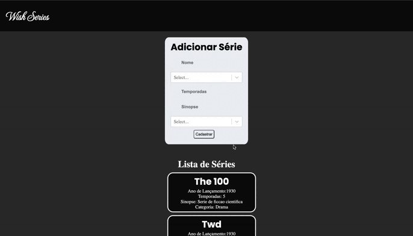

WISH SERIES

 

  

# React-JS--Crud-Mysql

## Installation

### Client

  1. `$ cd client`
  2. `$ npm install` or `$ yarn install`
  3. `$ npm start` or `$ yarn start`
  
### Server

  1. Change your mySQL database data `server/src/index.js`
  2. `$ cd server`
  3. `$ npm install` or `$ yarn`
  4. `$ npm rum devStart`
  
### API DATABASE address

  http://18.228.119.16:3001/get_series
  
## Functionalities

  + Create series in the database
  + Read series in the database
  + Update series in the database
  + Delete series in the database
  + Click card to edit and delete
  
## Used Libraries

### Front-end

 + `@material-ui`
 +  `Axios`
 +  `node-sass`
 +  `react-router`
 +  `react-select`

### Back-end

+ `express`
+ `mysql2`
+ `nodemon`
+ `cors`

### TODOLIST

**FRONTEND** => time limit exceeded   

[ x ] finish the frontend (make responsive and style the components by the right way)  
[ x ] run build (deploy and host the project)  

  
**BACKEND** => time limit exceeded   
  
  [ x ] apply the watched and to watch on the series cards  
  [ x ] add a image table on the data base to the user do the upload of the serie picture in the card  
  [ x ] use the react-router (already install) to manipulate some route on the project like the last one that i list before 
  [ x ] clear the code  
  
